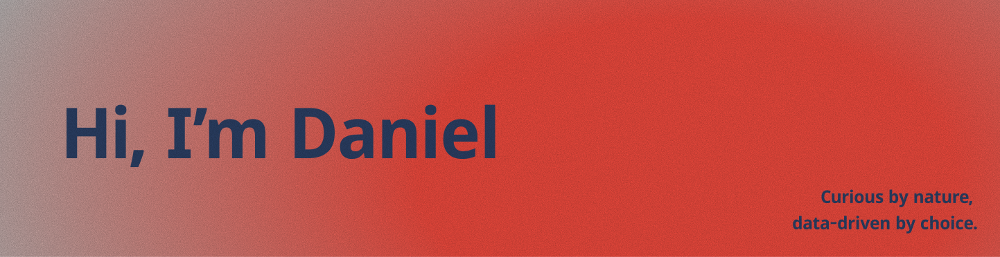

<!-- Banner full width with circular photo overlay -->

  
  
   
  <!-- Circular photo overlapping on center -->
  

  

### About Me
Data & AI Analyst with +5 years of experience at the intersection of **data, technology and business processes**. I transform repetitive manual work into actionable insights and automated solutions.

I started in Human Resources and evolved into People Analytics, process optimization and advanced analytics. Today I design and implement solutions with **Python, Power BI, RPA and low-code** that drive organizational efficiency and enable data-driven decisions.

-  Currently deepening skills in **Machine Learning, AI, Cloud & MLOps**
-  Ask me about **Python, process automation, Power BI and organizational analytics**
-  Turning complex operational problems into measurable, data-driven solutions
-  Passionate about applying data and AI to basketball (scouting, player evaluation and sports analytics)

Fun Fact: After 20 years of basketball, just realized I am no longer an explosive player...

---

### 🛠 Tech Stack & Tools
Tools I use to turn data into impact:

  

  
  
  
  

---

### 🚧 Currently Working On
**[Athlete Career Intelligence](https://github.com/dahuermar/Athlete_Career_Intelligence)** — a data portfolio project focused on sports analytics: a scouting tool designed to identify undervalued players through advanced statistical analysis.

---

### 🤝 Let's Connect

  
  
  

  

